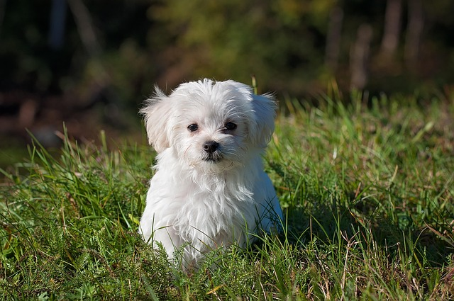

# 🖼️ Image Captioning AI

## 📌 Description

This project generates captions for images using the BLIP (Bootstrapping Language Image Pretraining) model from Hugging Face Transformers.

The model analyzes an input image and automatically generates a meaningful natural language description.

---

## 🚀 Features

- Generate captions from images
- Uses pre-trained BLIP Transformer model
- Supports multiple images
- Easy command-line interface
- Fast and accurate caption generation

---

## 🛠️ Technologies Used

- Python
- PyTorch
- Hugging Face Transformers
- Pillow

---

## 📦 Installation

Install the required libraries:

```bash
pip install -r requirements.txt
```

---

## ▶️ Run the Project

```bash
python app.py
```

---

## 📸 Example

Input:

```
sample.jpg
```

Output:

```
a dog running through a grassy field
```

---
## Sample Image


## 📂 Project Structure

```
Image-Captioning-AI
│── app.py
│── requirements.txt
│── README.md
```

---

## 👨‍💻 Author

**Aniket Tawale**

CodSoft Artificial Intelligence Internship
